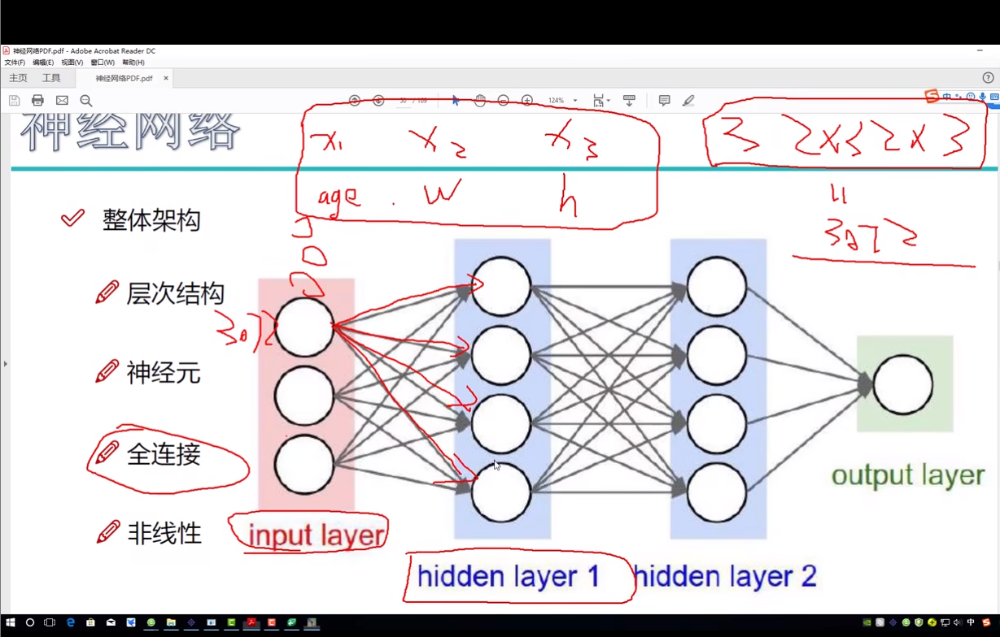
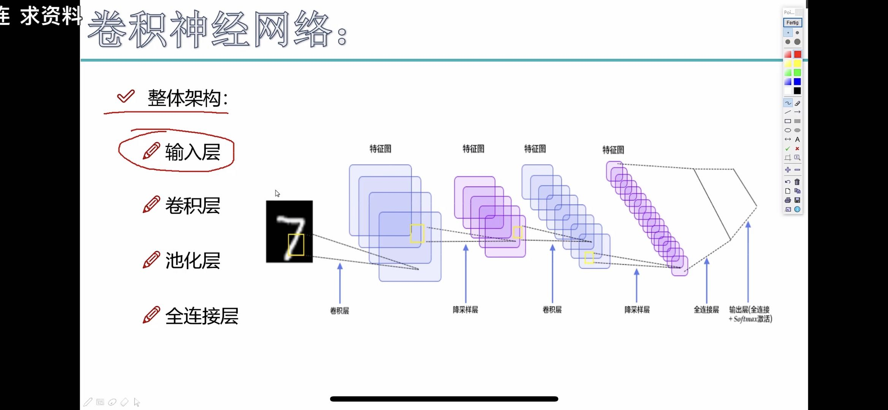
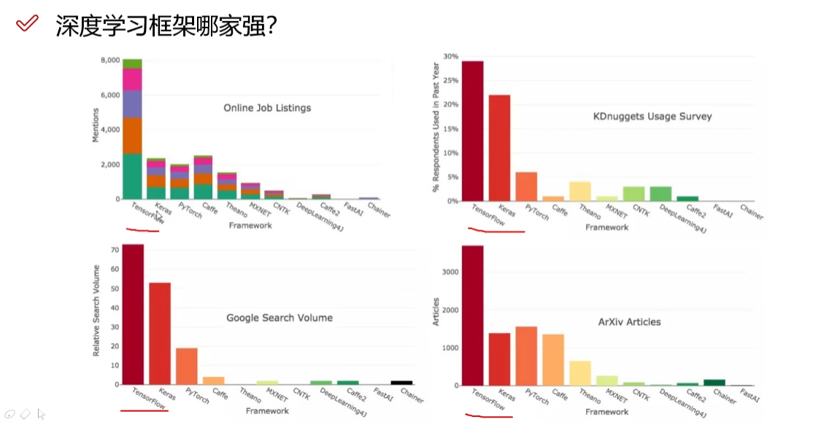

## 深度学习
1. *数据 权重 矩阵 参数*的计算过程
2. 整体架构  层级结构 神经元， 全连接，非线性函数

3. 卷积神经网络 **h(high)+w(width)+c(channel)**

   1.  卷积涉及到的参数: 
        - 滑动步长
        - 卷积核尺寸
        - 边缘填充
        - 卷积核个数
   2.  最大池化层(压缩)
   3.  整体架构 输入层(input) -> 卷积层(CONV) -> 激活函数(RELU) -> 池化层(POOL) -> 全链接层(FC)

4. RNN  NLP处理 只关心最后一个结果

5. LSTM 对RNN进行一个过滤
## 常用深度学习框架

## 机器学习算法分类
- 监督学习
  - 目标值连续-回归
  - 目标值离散- 分类
- 无监督学习-- 仅有 特征值
- 半监督学习
  - 有特征值， 但是一部分数据有目标值， 一部分没有目标值
- 强化学习
  - 动态过程， 上异步数据的输出是下一步数据的输入
     四要素 : agent, action, enviroment, Reward
## 模型评估
1. 分类模型评估
   - 准确率
   - 精确率
   - 召回率
   - F1-score
   - AUC指标
2. 回归模型评估
   - 均方根误差
   - 相对平方误差
   - 平均绝对误差
   - 相对绝对误差
   - 决定系数
3. 拟合
   - 欠拟合
   - 过拟合
